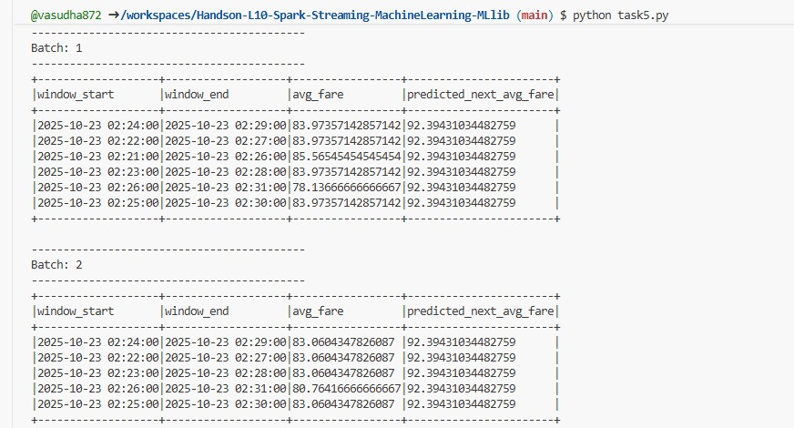

# Handson-L10-Spark-Streaming-MachineLearning-MLlib

## Project Overview **

This project implements a real-time analytics pipeline for a ride-sharing platform using Apache Spark Structured Streaming and MLlib. The system processes streaming ride data, trains machine learning models, and performs real-time predictions for:

Task 4: Real-time fare prediction based on distance
Task 5: Time-based fare trend prediction using windowed aggregations

## Project Structure

Handson-L10-Spark-Streaming-MachineLearning-MLlib/

```bash
│
├── README.md                          # This file
├── task4.py                          # Task 4: Real-time fare prediction
├── task5.py                          # Task 5: Time-based fare trend prediction
├── data_generator.py                 # Simulates streaming ride data
├── training-dataset.csv              # Historical data for model training
│
├── models/
│   ├── fare_model/                   # Task 4 trained model
│   │   ├── data/
│   │   └── metadata/
│   └── fare_trend_model_v2/          # Task 5 trained model
│       ├── data/
│       └── metadata/
├── outputimages/          
│   ├── task4.png
│   ├── task5.png
│   


```

# Setup Instructions 

Install dependencies:

```bash   
pip install pyspark
```

Verify files:
```bash
  ls -la
```

 # Ensure training-dataset.csv, data_generator.py, task4.py, and task5.py are present
 
Running the Project

For Task 4/Task 5:

Terminal 1 - Start Data Generator:
```bash
python data_generator.py
```

Terminal 2 - Run Tasks:
```bash
python task4.py/task5.py
```
# Challenges and Solutions 

Challenge 1: Empty Streaming Batches (Task 5)

Problem: Batches showing column headers but no data rows

Root Cause: Using append output mode with windowed aggregations

```bash
# Changed from:
.outputMode("append")

# To:
.outputMode("update")

```

Challenge 2: Connection Refused Error
Problem: java.net.ConnectException: Connection refused
Root Cause: Starting task scripts before data generator
Solution: Always start data_generator.py first, then task scripts
Correct Order:

Terminal 1: python data_generator.py
Wait for "Waiting for connection..."
Terminal 2: python task4.py or python task5.py

Challenge 4: Watermark Issues
Problem: Too strict watermark filtering out data
Solution: Increased watermark tolerance
```bash
# Changed from:
.withWatermark("event_time", "1 minute")

# To:
.withWatermark("event_time", "10 minutes")

```
## outputs 

## Task 4: Real-Time Fare Prediction


## Task 5: Time-Based Fare Trend Prediction




